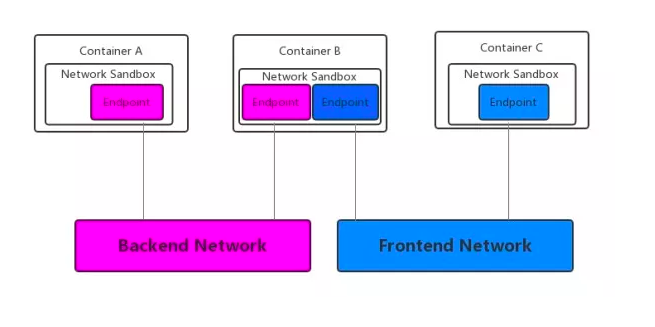
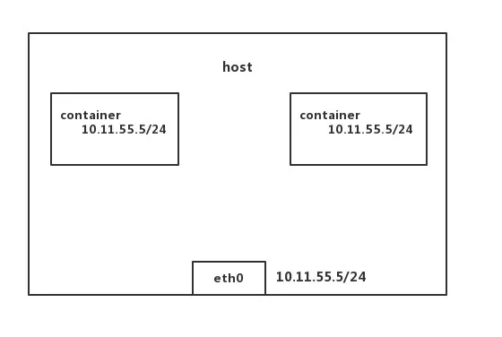

An article about how to set up network connection among containers on the same node.

Since the containers are on the same host, only bridge, host, none and container modes are under consideration.

I may discuss network connnection over nodes later. (overlay mode, etc)

The article is already post on wechat.

Refer to [here](https://mp.weixin.qq.com/s/ek7PV2SbKfTPN-Omb9nKHw).

# 阿里开源富容器引擎 PouchContainer 的 network 连接机制
## 引言
PouchContainer 是阿里巴巴集团开源的高效、轻量级企业级富容器引擎技术，拥有隔离性强、可移植性高、资源占用少等特性。可以帮助企业快速实现存量业务容器化，同时提高超大规模下数据中心的物理资源利用率。  
  
PouchContainer 源自阿里巴巴内部场景，诞生初期，在如何为互联网应用保驾护航方面，倾尽了阿里巴巴工程师们的设计心血。PouchContainer 的强隔离、富容器等技术特性是最好的证明。在阿里巴巴的体量规模下，PouchContainer 对业务的支撑得到双 11 史无前例的检验，开源之后，阿里容器成为一项普惠技术，定位于「助力企业快速实现存量业务容器化」。  
  
本文将给大家介绍 PouchContainer 实现 network 的机制以及将容器连接到 network 上的原理。为了充分阐述 network 的连接机制，本文将以Connect方法为例，叙述如何动态地将一个 container 连接到一个已存在的 network 上。  
  
## 1. PouchContainer 实现 network 的机制
在目前的容器网络虚拟化技术中，Docker 推行的 CNM (Container Network Model）模型是一种通用的解决方案，CNM 构建了一种成熟的容器虚拟化网络模型，并定义了多种供开发者调用的标准化接口。PouchContainer 沿用了 CNM 模型，基于 libnetwork 来实现容器间通信。下面先对 Sandbox、Endpoint 和 Network 这三个 CNM 中的核心组件进行介绍。  
Sandbox  
  
Sandbox 一词在不同的机制里，被分别赋予了不同的定义。例如，在 CRI（container runtime interface）里面 sandbox 就代表着 pod 的概念。而在 CNM 模型里，sandbox 代表着一个容器的网络栈配置，包含管理容器的网卡，路由表以及 DNS 设置。Sandbox 的具体实现可以通过 Linux 系统的 network namespace，一个 FreeBSD Jail 或者其他类似的概念。一个 sandbox 可以包含多个 endpoints。  
  
Endpoint  
  
一个 endpoint 将 sandbox 连接到 network 上。一个 endpoint 的实现可以通过 veth pair，Open vSwitch internal port 或者其他的方式。比较常见的方法是用 veth pair，顾名思义，veth pair一定是成对出现的，因此会存在 veth0 和 veth1 两块网卡。创建容器时，其中一块会被设置到容器内部，充当容器内部的eth0，所有目的地址为容器 IP 的数据包都要经过 eth0 网卡；另一块（以下称为 veth 设备）则会被连接到宿主机的网桥上。从 veth 设备出去的数据包，会转发到对应的 eth0 设备上，当数据包的目的地址为 eth0 设备的 IP 时，就能被内核协议栈处理。用 veth pair 来连接两个 network namespace，从而建立网络连通关系。一个 Endpoint 只能属于一个 Network，也只能属于一个 Sandbox。  
  
Network  
  
一个 Network 是一组可以相互通信的 Endpoints 的集合。一个 network 的实现可以通过 Linux bridge，VLAN 或者其他方式。值得一提的是，一个 network 中可以包含很多个 endpoints。  
  
可以看到，在如下图所示的结构下，Container A 和 Container B 同属于 backend network，这两个 container通过各自紫色的 endpoint 构成 network 连接；container B和 container C 同属于 frontend network，通过蓝色的 endpoint 构成 network 连接。因此 container A 和 container B之间可以通信，container B和 container C之间也可以通信。  
  
接下来重点看一下 container B 内部的两个 endpoints，虽然 backend network 和 frontend network 在 container B 内都有各自对应的 endpoint，但紫色 endpoint 和蓝色 endpoint 间不构成通信。因此 backend network 和 frontend network 是两个完全隔离的 network，并不因为连接同一个 container 而产生连通。显而易见，container A 和 container C 间其实是无法通信的。  

   
## 2.PouchContainer 内置的 network 模式
### 2.1 bridge 模式
bridge 模式是 PouchContainer 默认的网络模式，在创建容器不指定 network 模式，即不写--net参数，该容器就会以 bridge 模式创建。pouchd启动的时候，会自动在主机上创建一个虚拟网桥 p0。后续以 bridge 模式创建容器时，pouchd从 p0 网桥所在的 IP 网段中选取一个未使用的 IP 分配给容器的 eth0 网卡，p0 的 IP 是这些容器的默认网关。  

### 2.2 host 模式
在启动容器的时候，选择 host 模式，那么容器将不会获得独立的 network namespace，而是和主机共享 network namespace。因此，这个容器也就没有自己的网卡和 IP 配置，会使用主机的 IP 和端口，但 fs 和 pid 等与主机还是隔离的。  

### 2.3 container 模式
以 container 模式创建的容器，会和已经存在的容器共享一个 network namespace，直接沿用其 veth 设备对。  

### 2.4 none 模式
使用 none 模式创建的容器，拥有独立的 network namespace，但是不会对容器进行任何的网络配置。因此，可以认为 none 模式下的容器，是不和其它容器通信的。不过，在容器创建后，可以再给它添加网卡、配置 IP，这样就可以与同一个 network 下的容器通信了。  

### 2.5 CNM 与 network 模式的概念交叉
一个 network 是一个唯一的、可识别的 endpoint 组，组内的 endpoint 可以相互通讯。对比 CNM 来看，endpoint 可以简单理解成 veth 设备对，容器的 sandbox 里可以有多个 endpoints，每个 endpoint 代表和一个特定 network 的连接关系。  

## 3. network connect 的流程分析
// daemon/mgr/container.go  

可以看到在Connect函数里，首先根据传入的参数获取到具体的 container 和 network。而epConfig参数里面，存放的是在 CLI 端通过 flag 传入的参数，如 container 在特定 network 中的别名、指定的 IP 范围等。  
  
查看c.State.Status来判断 container 此时的状态，dead 状态的 container 是无法执行 connect 操作的。对于非 running 但是还 live的container，只是简单地调用updateNetworkConfig（）来更新 container 的网络配置，将传入的epConfig加入到容器的 network 配置中。在这种情况下，不会为 container 分配网卡，因此 container 并没有成功连通到 network 中。对于 running 状态的 container，调用connectToNetwork（）来进行后续的操作，connectToNetwork（）会根据给定的 network 和 container 进行网卡的配置，再在主机上分配一个网卡，最后将网卡加入到 container 的 sandbox 里面。这样，container 就成功地连接到 network 上了！具体的流程会在后续进行解析。  
  
c.Write(mgr.Store)的作用，是将 container 连接到 network 上的一系列配置写入 container 的 metadata 里面，这样就保证了数据的持久化。否则，建立的 network 连接只是一次性的，所有的数据和相关配置在pouchd重启后都会丢失。  
  
// daemon/mgr/container.go  

endpoint 里面包含三部分的信息，一部分的信息来自于 container，一部分的信息来自 network，最后一部分信息是 connect 命令里 flag 中的配置。buildContainerEndpoint（）的逻辑比较简单，就是获取到 endpoint 需要的 container 相关信息。随后调用了NetworkMgr的EndpointCreate（）来进行具体的构建。  
  
// daemon/mgr/network.go  

创建 endpoint 的整个过程，都是调用 libnetwork 来实现的。首先调用endpointOptions（）来构建接口要求的EndpointOption参数，这个 setter 函数类型的参数能将不同的 option 传递给 network 和 endpoint 的接口。随后调用 libnetwork 的
CreateEndpoint（）接口来进行具体的构建。CreateEndpoint（）执行的实际工作包括为这个 endpoint 分配 IP 和接口（Iface），对应的配置会被应用到 Endpoint 中，其中包括 iptables 的配置规则和端口信息等。

Sandbox 所代表的就是 container 独有的 network namespace，其创建也是基于 libnetwork。sandbox 里面包含 container 建立网络通信的标志性信息，如 IP 地址、Mac 地址、路由和 DNS 等配置。会对已存在的 sandbox 进行遍历，判断是否存在相应的 sandbox，存在的话就直接返回对应的 sandbox。在 none 模式下，container 沿用主机的 namespace，返回的 sandbox 为空，这时候会创建一个新的 sandbox。sandbox 的创建过程，就是调用 namespace 和 cgroup 来创建一个独立 sandbox 空间。  
  
将 endpoint 加入到 sandbox 的操作，实际上就是将网卡分配给 container 的过程，将 endpoint 分配到的网络资源注入到 sandbox 中。网卡是建立连接的核心，container 通过虚拟网卡连接到 network，从而与其它 container 进行通信。  
  
最后一步，将变化同步更新到 endpoint 的配置里面。  

## 4. 总结
回顾建立 network 连接的整个流程，可以简单的分成几步。container 在通信时需要唯一的 network namespace 来标志自己，那么就要有 sandbox 的创建；通信的实现需要网卡作为基础，那么就要有 endpoint 的创建；最后将endpoint  加入 sandbox，建立容器间通信的基础，连接的建立就成功完成了。  
